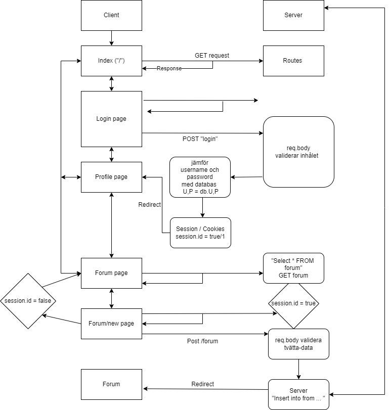

# Ett forum med login function
Tim Fagerdal

04-04-2023

## Inledning

## Bakgrund
I detta projekt har fokuset satt på att använda information från en databas på webben. Projektet använder sig av routs i javascript för att kunna nå information från en mySQL server med mySQL kommando. 

Projektet började med att göra ett diagram med flödesschema för att rita upp alla funktioner som kommer att användas och hur dem är kopplad med resten av projektet. 

Efter flödesschema gjordes en fork av handledarens repo på git och sedans kopplades login system från ett föredetta projekt samt samma från ett annat projekt med forumet. 

## Positiv Erfarenhet 
Det positiva erfarenheter jag hade i detta projekt har varit att sätta ihop dem två projektens kod och få det att funka. Det tog lite tid att ta dem rätt delarna och ändra dem lite så dem funkar, men det gick bra utan att fastna  mycket som gjorde att arbets gången var flytande. Det var intresant att lära sig om hur man kan använda sig av javascript för att manupelera webbsidan. Projektet i hell het så är jag ganska nöjd med vad som finns och att det funkar är positivt.

## Negativ Erfarenhet 
Jag hade det svårt att skapa validerings koden samt att fels söka i vissa områden. Det största problemet från början var att kunna skicka saker till databasen från webbsidan, som den inte gjorde och bara satt och ladda. Jag visste vad för typ av fel det var för jag inte fick ett fel meddelande som betydde att programet inte kunde komma ut ur en viss område i koden. Dock att hitta vars det var tog lång tid. Att få validators dellen att funka vara bara massa if funktioner att sitta ihop rätt men det var lite svårt och få ihop det på ett bra sätt var jobit att försöka fixa. 

## Sammanfattning 
Detta projekt har varit roligt att jobba med vissa svårigheter men många trevliga stunder som man kunde ta kunskap från. Kunde behöva mer tid att skapa ett bra validators system med hjälp av läraren för att skappa problem i databasen. Så den dellen är säkrare. Men annars har detta varit roligt med många saker man fått möjligheten att göra. 